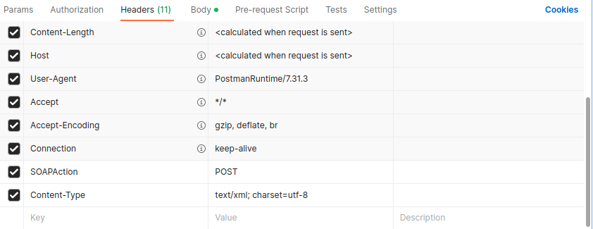
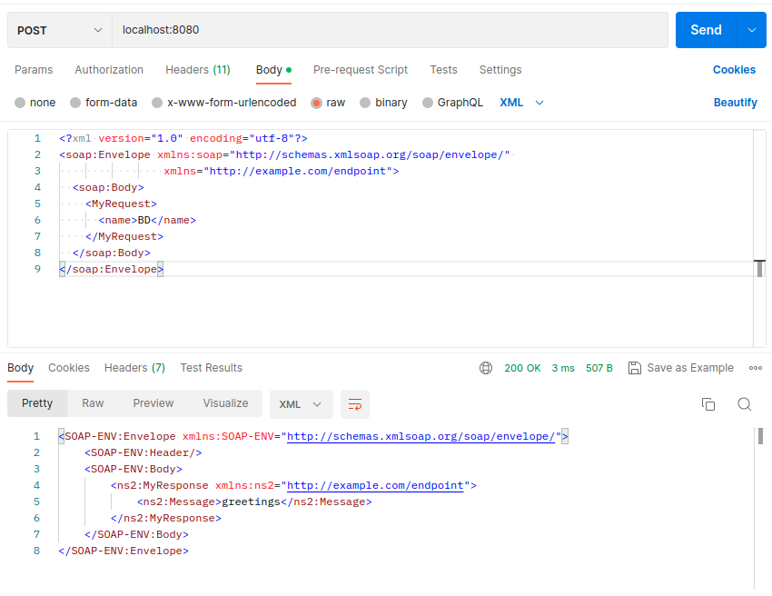

# Getting Started

### Sample SOAP request

```
<?xml version="1.0" encoding="utf-8"?>
<soap:Envelope xmlns:soap="http://schemas.xmlsoap.org/soap/envelope/"
    xmlns="http://example.com/endpoint">
    <soap:Body>
        <MyRequest>
            <name>BD</name>
        </MyRequest>
    </soap:Body>
</soap:Envelope>
```

### Postman set-up
 * Add following at the Headers 
   * `SOAPAction` : `POST`
   * `Content-Type` : `text/xml; charset=utf-8`
 * Change the request type to `POST`
 * Put the above SOAP request at the `Body` 
   * select `raw`
   * select `XML` at data type

### Reference screenshots
#### Headers Config


#### Body config


